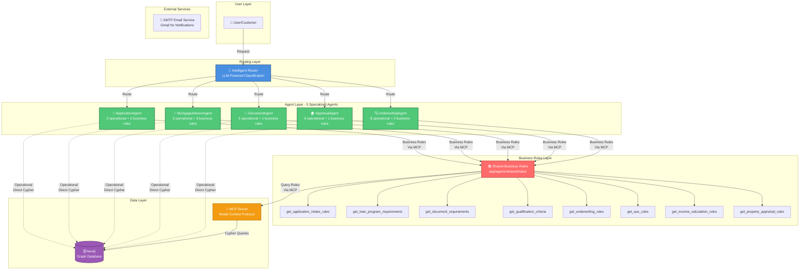
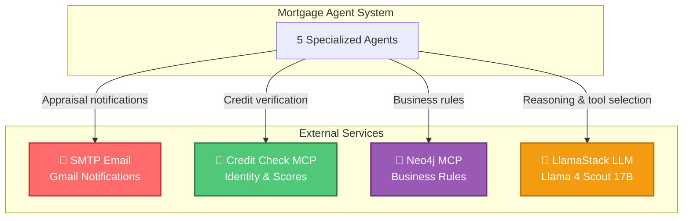
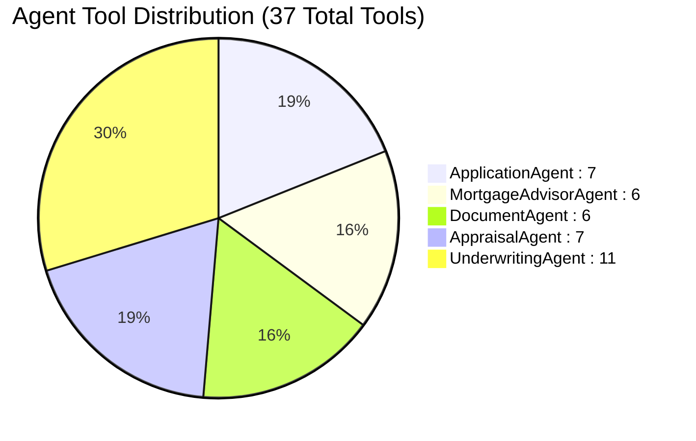
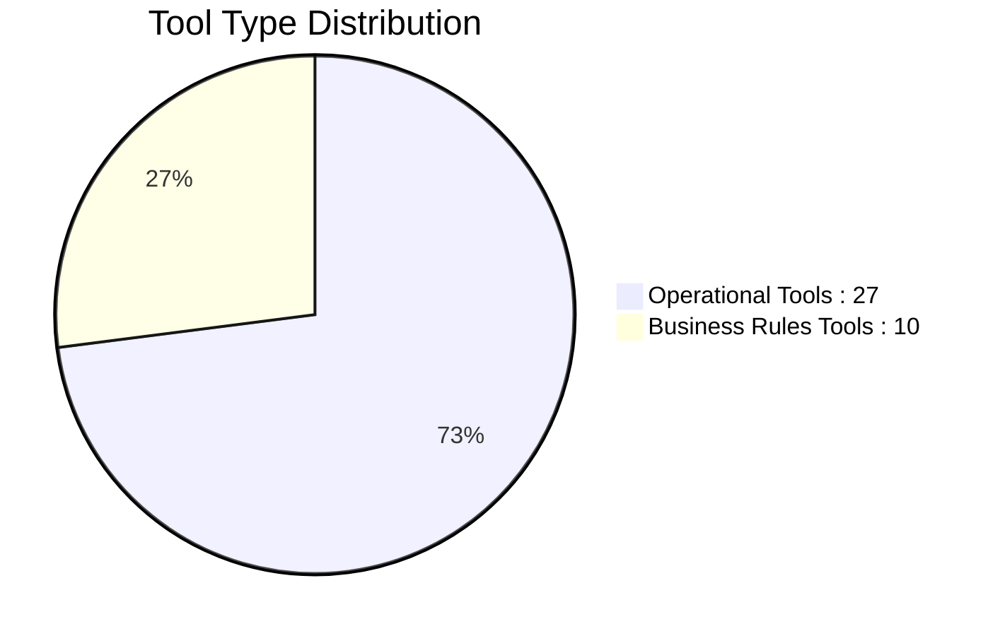
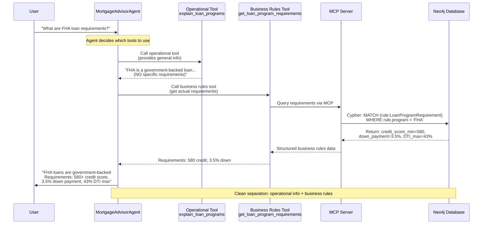
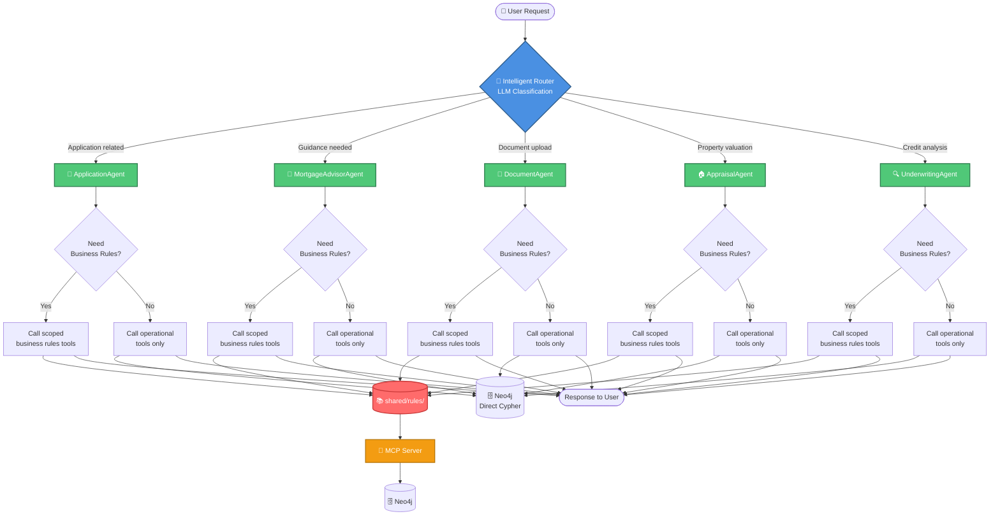

# Mortgage Agent System - Architecture Diagrams

## 🏗️ Overview

This document contains visual diagrams explaining the refactored mortgage agent system architecture, focusing on the separation of operational tools and business rules.

---

## 1️⃣ System Architecture Overview



**Key Principles:**
-  Each agent has operational tools (direct Neo4j access)
-  Each agent has scoped business rules tools (via MCP)
-  Business rules are centralized in `shared/rules/`
-  Clean separation of concerns

---

## 2️⃣ External Services Integration



**Integrated Services:**
- 📧 **SMTP Email:** Gmail-based notifications for appraisal scheduling
- 🔌 **Credit Check MCP:** Real-time credit scores and identity verification
- 🔌 **Neo4j MCP:** Dynamic business rules without hardcoding
- 🤖 **LlamaStack LLM:** Agent reasoning and decision making

---

## 3️⃣ Tool Architecture - Operational vs Business Rules

```mermaid
graph TB
    subgraph "ApplicationAgent - 7 Total Tools"
        direction TB
        subgraph "Operational Tools (5)"
            AA1[receive_mortgage_application]
            AA2[retrieve_stored_application]
            AA3[check_application_completeness]
            AA4[perform_initial_qualification]
            AA5[generate_urla_form]
        end
        subgraph "Business Rules (2 - Scoped)"
            AAR1[get_application_intake_rules]
            AAR2[get_loan_program_requirements]
        end
    end
    
    subgraph "MortgageAdvisorAgent - 6 Total Tools"
        direction TB
        subgraph "Operational Tools (3)"
            MA1[explain_loan_programs]
            MA2[recommend_loan_program]
            MA3[check_qualification_requirements]
        end
        subgraph "Business Rules (3 - Scoped)"
            MAR1[get_loan_program_requirements]
            MAR2[get_qualification_criteria]
            MAR3[get_underwriting_rules]
        end
    end
    
    subgraph "DocumentAgent - 6 Total Tools"
        direction TB
        subgraph "Operational Tools (5)"
            DA1[process_uploaded_document]
            DA2[extract_document_data]
            DA3[get_document_status]
            DA4[verify_document_completeness]
            DA5[validate_urla_form]
        end
        subgraph "Business Rules (1 - Scoped)"
            DAR1[get_document_requirements]
        end
    end
    
    subgraph "AppraisalAgent - 7 Total Tools"
        direction TB
        subgraph "Operational Tools (6)"
            AP1[schedule_appraisal]
            AP2[analyze_property_value]
            AP3[find_comparable_sales]
            AP4[assess_property_condition]
            AP5[review_appraisal_report]
            AP6[evaluate_market_conditions]
        end
        subgraph "Business Rules (1 - Scoped)"
            APR1[get_property_appraisal_rules]
        end
    end
    
    subgraph "UnderwritingAgent - 11 Total Tools"
        direction TB
        subgraph "Operational Tools (8)"
            UA1[analyze_credit_risk]
            UA2[calculate_debt_to_income]
            UA3[evaluate_income_sources]
            UA4[run_aus_check]
            UA5[make_underwriting_decision]
            UA6[get_credit_score - MCP]
            UA7[verify_identity - MCP]
            UA8[get_credit_report - MCP]
        end
        subgraph "Business Rules (3 - Scoped)"
            UAR1[get_underwriting_rules]
            UAR2[get_aus_rules]
            UAR3[get_income_calculation_rules]
        end
    end
    
    style AA1 fill:#E8F5E9,stroke:#4CAF50,stroke-width:2px
    style AA2 fill:#E8F5E9,stroke:#4CAF50,stroke-width:2px
    style AA3 fill:#E8F5E9,stroke:#4CAF50,stroke-width:2px
    style AA4 fill:#E8F5E9,stroke:#4CAF50,stroke-width:2px
    style AA5 fill:#E8F5E9,stroke:#4CAF50,stroke-width:2px
    style AAR1 fill:#FFEBEE,stroke:#F44336,stroke-width:2px
    style AAR2 fill:#FFEBEE,stroke:#F44336,stroke-width:2px
```



**Color Legend:**
- 🟢 **Green:** Operational Tools (NO hardcoded business rules)
- 🔴 **Red:** Business Rules Tools (from shared/rules/, via MCP)

---

## 4️⃣ Tool Statistics Summary





**Statistics:**
- **5 Agents** (all production-ready)
- **37 Total Tools** across all agents
- **27 Operational Tools** (NO hardcoded business rules)
- **10 Business Rules Tools** (scoped to agent needs)
- **NEW:** Email notification service integrated

---

## 5️⃣ Business Rules Access Pattern



**Key Points:**
- Operational tools: General information, calculations, status checks
- Business rules tools: Actual thresholds, requirements, limits
- MCP: Protocol for accessing business rules from Neo4j
- Agent orchestrates: Combines operational and business rules as needed

---

## 6️⃣ Request Flow Through System



---

## 7️⃣ Detailed Agent Configuration

| Agent | Operational Tools | Business Rules Tools | Total | Purpose |
|-------|------------------|---------------------|-------|---------|
| **ApplicationAgent** | 5 | 2 | **7** | Application intake, data collection, URLA generation |
| **MortgageAdvisorAgent** | 3 | 3 | **6** | Customer guidance, loan recommendations, qualification advice |
| **DocumentAgent** | 5 | 1 | **6** | Document processing, verification, status tracking |
| **AppraisalAgent** | 6 | 1 | **7** | **Appraisal scheduling, notifications**, property valuation, market analysis |
| **UnderwritingAgent** | 8 | 3 | **11** | Credit analysis, DTI calculation, underwriting decisions |

### ApplicationAgent Tools
**Operational (5):**
1. `receive_mortgage_application` - Collect application data
2. `retrieve_stored_application` - Retrieve saved applications
3. `check_application_completeness` - Verify data completeness
4. `perform_initial_qualification` - Calculate DTI/LTV (NO thresholds)
5. `generate_urla_form` - Generate URLA Form 1003

**Business Rules (2):**
1. `get_application_intake_rules` - Required fields, validation rules
2. `get_loan_program_requirements` - Program-specific requirements

---

### MortgageAdvisorAgent Tools
**Operational (3):**
1. `explain_loan_programs` - Explain loan types (NO specific requirements)
2. `recommend_loan_program` - Calculate metrics, suggest programs (NO qualification)
3. `check_qualification_requirements` - Check data completeness (NO thresholds)

**Business Rules (3):**
1. `get_loan_program_requirements` - Program requirements
2. `get_qualification_criteria` - Qualification thresholds
3. `get_underwriting_rules` - Credit/DTI/LTV requirements

---

### DocumentAgent Tools
**Operational (5):**
1. `process_uploaded_document` - Process document content
2. `extract_document_data` - Extract structured data
3. `get_document_status` - Check upload status
4. `verify_document_completeness` - List uploaded docs (NO requirements)
5. `validate_urla_form` - Validate URLA structure

**Business Rules (1):**
1. `get_document_requirements` - Required documents by loan type

---

### AppraisalAgent Tools
**Operational (6):**
1. `schedule_appraisal` - **Schedule appraisal appointments & send email notifications** ⭐ **NEW**
2. `analyze_property_value` - Property valuation analysis
3. `find_comparable_sales` - Research comparable properties
4. `assess_property_condition` - Property condition assessment
5. `review_appraisal_report` - Review appraisal documents
6. `evaluate_market_conditions` - Market trend evaluation

**Business Rules (1):**
1. `get_property_appraisal_rules` - LTV limits, appraisal standards

---

### UnderwritingAgent Tools
**Operational (8):**
1. `analyze_credit_risk` - Credit risk analysis (NO thresholds)
2. `calculate_debt_to_income` - DTI calculation (NO limits)
3. `evaluate_income_sources` - Income source evaluation
4. `run_aus_check` - AUS system integration
5. `make_underwriting_decision` - Decision analysis (NO approval rules)
6. `get_credit_score` - MCP: Real-time credit scores
7. `verify_identity` - MCP: Identity verification
8. `get_credit_report` - MCP: Credit reports

**Business Rules (3):**
1. `get_underwriting_rules` - Credit/DTI/LTV requirements
2. `get_aus_rules` - AUS system rules
3. `get_income_calculation_rules` - Income qualification rules

---

## 8️⃣ Code Organization Structure

```
app/agents/
├── shared/                          #  Shared utilities
│   ├── rules/                       # 🔴 Business Rules (MCP)
│   │   ├── __init__.py             
│   │   ├── get_application_intake_rules.py
│   │   ├── get_loan_program_requirements.py
│   │   ├── get_document_requirements.py
│   │   ├── get_qualification_criteria.py
│   │   ├── get_underwriting_rules.py
│   │   ├── get_aus_rules.py
│   │   ├── get_income_calculation_rules.py
│   │   └── get_property_appraisal_rules.py
│   └── prompt_loader.py
│
├── application_agent/               # 📝 Application Agent
│   ├── agent.py                    # Combines operational + business rules
│   ├── prompts.yaml
│   └── tools/                       # 🟢 Operational tools only
│       ├── __init__.py
│       ├── receive_mortgage_application.py
│       ├── retrieve_stored_application.py
│       ├── check_application_completeness.py
│       ├── perform_initial_qualification.py
│       └── generate_urla_form.py
│
├── mortgage_advisor_agent/          # 💼 Advisor Agent
│   ├── agent.py
│   ├── prompts.yaml
│   └── tools/                       # 🟢 Operational tools only
│       ├── __init__.py
│       ├── explain_loan_programs.py
│       ├── recommend_loan_program.py
│       └── check_qualification_requirements.py
│
├── document_agent/                  # 📄 Document Agent
│   ├── agent.py
│   ├── prompts.yaml
│   └── tools/                       # 🟢 Operational tools only
│       ├── __init__.py
│       ├── process_uploaded_document.py
│       ├── extract_document_data.py
│       ├── get_document_status.py
│       ├── verify_document_completeness.py
│       └── validate_urla_form.py
│
├── appraisal_agent/                 # 🏠 Appraisal Agent
│   ├── agent.py
│   ├── prompts.yaml
│   └── tools/                       # 🟢 Operational tools only
│       ├── __init__.py
│       ├── schedule_appraisal.py          # ⭐ NEW: Scheduling + Email
│       ├── analyze_property_value.py
│       ├── find_comparable_sales.py
│       ├── assess_property_condition.py
│       ├── review_appraisal_report.py
│       └── evaluate_market_conditions.py
│
├── underwriting_agent/              # 🔍 Underwriting Agent
│   ├── agent.py
│   ├── prompts.yaml
│   └── tools/                       # 🟢 Operational tools only
│       ├── __init__.py
│       ├── analyze_credit_risk.py
│       ├── calculate_debt_to_income.py
│       ├── evaluate_income_sources.py
│       ├── run_aus_check.py
│       ├── make_underwriting_decision.py
│       ├── get_credit_score.py (MCP)
│       ├── verify_identity.py (MCP)
│       └── get_credit_report.py (MCP)
│
└── mortgage_workflow.py             # 🎯 Router (5 agents, no business_rules_agent)
```

---

## 9️⃣ Key Architectural Decisions

###  **What Changed:**
1. **Deleted `business_rules_agent`** - No longer a separate agent
2. **Centralized business rules** - All in `shared/rules/`
3. **Scoped business rules** - Each agent gets only what it needs
4. **Clean tool separation** - Operational vs. business rules
5. **Direct access** - Agents call business rules directly (no routing)

###  **Design Principles:**
1. **Operational tools** → NO hardcoded business rules
2. **Business rules tools** → From `shared/rules/`, accessed via MCP
3. **Operational tools** → Call Neo4j DIRECTLY (for speed)
4. **Business rules tools** → Call Neo4j via MCP (for consistency)
5. **Each agent** → Only includes business rules it needs (scoped)

###  **Benefits:**
- **Faster response times** - No agent-to-agent routing
- **Better maintainability** - Business rules in one location
- **Clearer separation** - Operational vs. business logic
- **Easier testing** - Test operational and business rules independently
- **Flexible scaling** - Add new agents or rules without impacting others

---

## 🎯 **Summary**

The current architecture achieves:
-  **5 specialized agents** (no business_rules_agent)
-  **37 total tools** (27 operational, 10 business rules)
-  **Clean separation** (operational vs. business rules)
-  **Scoped business rules** (each agent has only what it needs)
-  **Centralized rules** (shared/rules/ directory)
-  **Direct access** (no routing to separate business rules agent)
-  **Email notifications** (SMTP-based appraisal scheduling) ⭐ **NEW**
-  **Real database integration** (Neo4j for appraisal orders)

**Result:** A production-ready, efficient, and scalable mortgage processing system!
